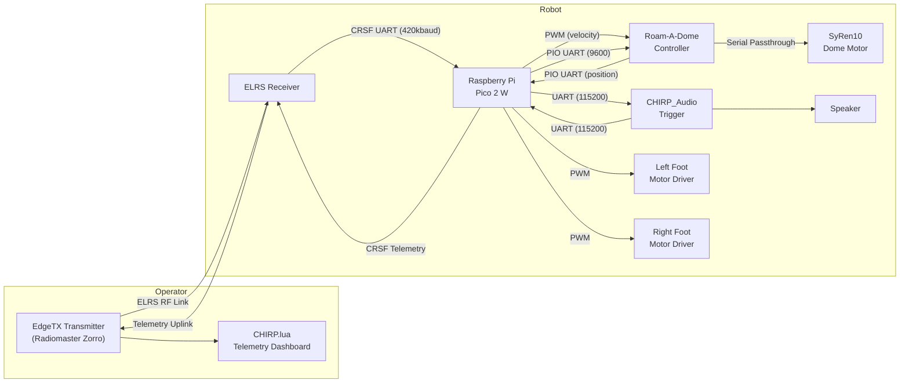
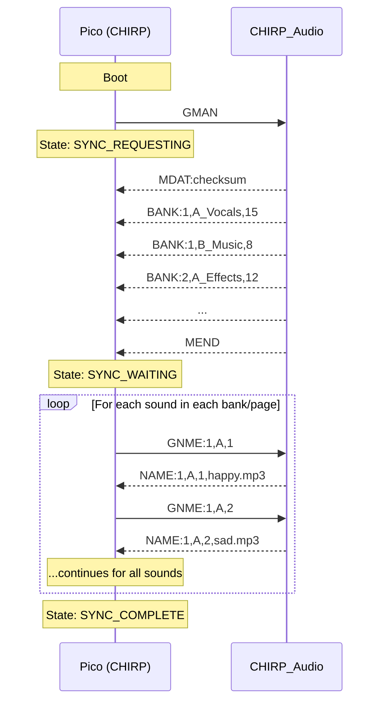
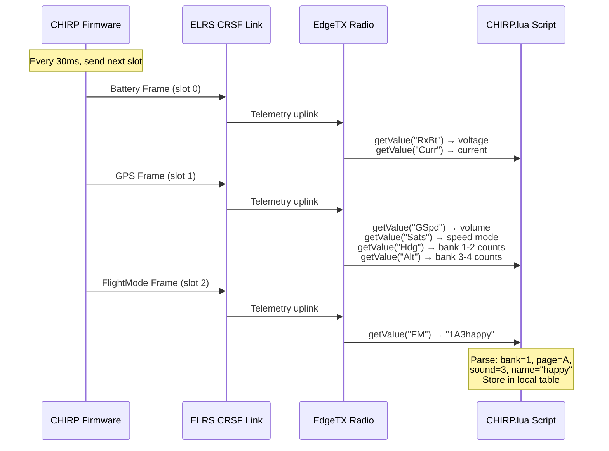

# CHIRP Droid Control — System Overview

This is control firmware for an R2-D2 style mobile robot. It runs on a **Raspberry Pi Pico 2 W** (RP2350) and is operated remotely via a **Radiomaster Zorro** EdgeTX transmitter (additional transmitter support expected in future) over **ExpressLRS** or **Crossfire** RC radio link. A companion **Lua telemetry script** on the transmitter provides a live sound dashboard and diagnostics display.

This document describes the complete system architecture, data flows, and design rationale as implemented in the firmware.

---

## Table of Contents

- [System Architecture](#system-architecture)
- [Hardware & Pin Assignments](#hardware--pin-assignments)
- [RC Channel Map](#rc-channel-map-radiomaster-zorro-profile)
- [Sound Playback System](#sound-playback-system)
- [Audio Manifest Sync](#audio-manifest-sync)
- [Telemetry System](#telemetry-system)
- [Lua Telemetry Script](#lua-telemetry-script-chirplua)
- [Dome Control](#dome-control)
- [Foot Drive](#foot-drive)
- [Autodome & Autochirp](#autodome--autochirp)
- [Debug Systems](#debug-systems)
- [File Structure](#file-structure)

---

## System Architecture



### Data Flow Summary

| Path | Purpose | Protocol |
|------|---------|----------|
| Transmitter → ELRS → Pico | RC channel values (sticks, switches, knobs) | CRSF @ 420000 baud |
| Pico → ELRS → Transmitter | Telemetry (battery, sound names, diagnostics) | CRSF telemetry frames |
| Pico → CHIRP_Audio | Play/stop commands, manifest requests, voice debug | Serial @ 115200 baud |
| CHIRP_Audio → Pico | Manifest data, sound names, command ACKs | Serial @ 115200 baud |
| Pico → Roam-A-Dome | Dome velocity (PWM) + serial commands | PWM + PIO UART @ 9600 |
| Roam-A-Dome → Pico | Dome position reports | PIO UART @ 9600 |
| Pico → USB | Debug serial output | USB CDC @ 115200 baud |

---

## Hardware & Pin Assignments

### UART Allocation

The RP2350 has 2 hardware UARTs plus programmable PIO state machines that can emulate additional UARTs. CHIRP uses 4 total serial interfaces without any SoftwareSerial hacks.

| UART | Peripheral | Baud Rate | TX Pin | RX Pin | Type |
|------|-----------|-----------|--------|--------|------|
| Serial (USB) | Debug output | 115200 | — | — | USB CDC |
| Serial1 (HW UART0) | CRSF / ELRS RX | 420000 | GP0 | GP1 | Hardware |
| Serial2 (HW UART1) | CHIRP_Audio | 115200 | GP4 | GP5 | Hardware |
| SerialPIO (PIO0) | Roam-A-Dome | 9600 | GP8 | GP9 | PIO UART |
| *(Future)* SerialPIO (PIO1) | Marcduino | 9600 | GP16 | GP17 | PIO UART |

### Other Pins

| Function | Pin | Type |
|----------|-----|------|
| Left Foot Motor PWM | GP10 | PWM Output |
| Right Foot Motor PWM | GP11 | PWM Output |
| Dome Motor PWM | GP12 | PWM Output (to Roam-A-Dome) |
| Status LED | GP25 | Digital Output (onboard) |
| Battery 1 Voltage | GP26 | ADC0 |
| Battery 2 Voltage | GP27 | ADC1 |
| Battery 3 Voltage | GP28 | ADC2 |

---

## RC Channel Map (Radiomaster Zorro Profile)

> **Note:** This channel map is specific to the Radiomaster Zorro. The architecture is designed so that future transmitter profiles (e.g., GX12, TX15 with their 6-button layouts) can use different channel assignments without rewriting core logic.

| Channel | Function | Input Type | Notes |
|---------|----------|-----------|-------|
| 1 | Roll (Steering) | Stick Axis | Left/Right mixing for foot motors |
| 2 | Pitch (Throttle) | Stick Axis | Forward/Reverse mixing for foot motors |
| 3 | Autodome Frequency | Stick Axis | Controls how often autodome moves |
| 4 | Yaw (Dome Rotation) | Stick Axis | Manual head rotation speed/direction |
| 5 | Arm / Disarm | 2-pos Switch | Enables/disables foot drive motors |
| 6 | Volume | Knob / Pot | Audio volume 0–100 |
| 7 | Sound Index | Knob / Pot | Selects sound within current bank/page |
| 8 | Play Trigger | 4 Momentary Buttons | Mapped to single channel; see zone logic below |
| 9 | *(Available)* | | |
| 10 | Speed Mode | 3-pos Switch | Slow (30%) / Medium (70%) / Fast (100%) |
| 11 | Auto Toggle | 3-pos Momentary (Trim) | Press UP = toggle Autodome, Press DOWN = toggle Autochirp |
| 12 | *(Available)* | | |
| 13 | Page Select | 3-pos Switch | Page A / B / C (affects Banks 2–4 only) |

### Channel 8 — Play Trigger (6-Zone Logic)

Four momentary buttons on the Zorro are mixed into a single channel. The firmware detects 6 zones based on channel value:

| Zone | Channel Range | Action |
|------|--------------|--------|
| 0 (Idle) | 1350 – 1650 | No action |
| 1 | 900 – 1149 | Button SD → Bank 1 sound (on release) |
| 2 | 1150 – 1349 | Button SA → Bank 2 sound (on release) |
| 3 | 1650 – 1849 | Button SG → Bank 3 sound (on release) |
| 4 | 1850 – 2000 | Button SH → Bank 4 sound (on release) |
| 5 (Stop) | > 2000 | SD + SA held → Stop all playback (immediate) |

**Key behaviors:**
- Sound triggers fire on **button release** (transition from active zone back to idle), not on press
- Stop All fires **immediately** when zone 5 is detected
- An `enteredFromIdle` guard prevents accidental triggers when releasing from a two-button Stop All — the channel briefly passes through a single-button zone on its way back to center, and this guard ensures that transient is ignored

### Channel 11 — Autodome/Autochirp Toggle (Momentary Trim Button)

A Zorro trim button is configured as a 3-position momentary switch. The toggle fires on the **press edge** (transition from center to up/down), not on release:

| Trim Direction | Channel Value | Action |
|----------------|--------------|--------|
| Center | ~1500 | Idle — no action |
| Pressed UP | > 1800 | Toggle Autodome on/off |
| Pressed DOWN | < 1200 | Toggle Autochirp on/off |

This approach uses one channel for two toggle functions, freeing a physical switch for other uses.

---

## Sound Playback System

### Sound Organization

Sounds on the CHIRP_Audio SD card are organized into **Banks** and **Pages**:

- **Banks** (up to 4 on Zorro): Each of the 4 trigger buttons plays from a different bank
- **Pages** (A, B, C): Sub-groups within each bank, switchable via a 3-pos switch
- **Sounds**: Up to 24 sounds per page, selected by the Sound Index knob

```
SD Card/
├── 1_A_Vocals/       ← Bank 1, Page A
│   ├── happy.mp3
│   ├── sad.mp3
│   └── ...
├── 1_B_Music/        ← Bank 1, Page B
├── 2_A_Effects/      ← Bank 2, Page A
└── ...
```

### Sound Selection Flow

1. Operator turns the **Sound Index knob** (Ch 7) to browse sounds in a bank
2. The knob value (988–2012 µs) is mapped to the sound count of that bank's current page
3. Pressing a **trigger button** (Ch 8) enters a zone (1–4)
4. **Releasing** the button triggers playback of the selected sound from that zone's bank
5. The Pico sends `PLAY:soundIndex,bankIndex,pageChar,volume` to CHIRP_Audio over UART2

**Bank 1 exception**: Always uses Page A regardless of the page switch position (Bank 1 is configured directly on the CHIRP_Audio board).

---

## Audio Manifest Sync

The biggest improvement over the original CHIRP_Core — manifest sync is now **completely non-blocking**. The robot remains fully operational while sound names are being loaded.

### Protocol Sequence



### State Machine

| State | Description | Timeout Behavior |
|-------|-------------|-----------------|
| `SYNC_IDLE` | Initial state | — |
| `SYNC_REQUESTING` | Sent `GMAN`, waiting for `MDAT`/`BANK`/`MEND` | Retries `GMAN` after 1 second |
| `SYNC_WAITING` | Requesting individual sound names via `GNME` | Retries current `GNME` after 1 second |
| `SYNC_COMPLETE` | All names loaded | — |

**During sync**, sound names display as placeholders (`"Snd 1"`, `"Snd 2"`, etc.) on the Lua dashboard. Once each name is received, it replaces the placeholder in real time.

### Manifest Data Structures (in RAM)

```cpp
AudioManifest manifest;
  └── banks[4]              // 4 SoundBanks
       └── pages[3]         // 3 BankPages per bank (A, B, C)
            ├── name[12]    // Page display name
            ├── soundCount  // Number of sounds on this page
            └── sounds[24]  // Up to 24 Sounds
                 └── name[12]  // Sound display name (max 11 chars)
```

---

## Telemetry System

The Pico sends telemetry data upstream through the CRSF link to the EdgeTX transmitter. Because CRSF has limited bandwidth and specific frame types, CHIRP uses a **round-robin scheduler** and creative data packing to transmit everything the Lua dashboard needs.

### Round-Robin Schedule

The scheduler cycles through 3 telemetry slots at 30ms per slot (each type updates ~11 times per second):

| Slot | CRSF Frame Type | Content |
|------|----------------|---------|
| 0 | Battery Sensor (`0x08`) | Multi-battery voltage + current draw |
| 1 | GPS (`0x02`) | Sound counts, volume, speed mode |
| 2 | Flight Mode (`0x21`) | Sound/page name strings |

### Slot 0 — Battery Sensor Frame

The standard CRSF Battery Sensor frame has 4 fields. CHIRP repurposes them:

| Field | Standard CRSF Use | CHIRP Use |
|-------|------------------|------------|
| `voltage` | Battery voltage | Multi-battery voltage (offset encoding) |
| `current` | Current draw | Instantaneous current draw (100mA units) |
| `capacity` | mAh consumed | Peak current since boot (repurposed) |
| `remaining` | Battery % | Fixed at 100 |

#### Multi-Battery Offset Encoding

The firmware has a single `voltage` field but needs to report up to 3 batteries. It cycles through them and adds an offset so the Lua script can tell which battery is being reported:

| Cycle | Value Sent | Lua Decoding |
|-------|-----------|-------------|
| 0 | `battery1 × 10` | Raw value < 1000 → Primary battery voltage |
| 1 | `(battery2 × 10) + 1000` | Value ≥ 1000 and < 2000 → Secondary (subtract 1000, divide by 10) |
| 2 | `(battery3 × 10) + 2000` | Value ≥ 2000 → Tertiary (subtract 2000, divide by 10) |

Example: Primary = 12.2V → sent as `122`. Secondary = 11.9V → sent as `1119`. The Lua script decodes them into separate display values.

### Slot 1 — GPS Frame (Sound Counts & Status)

The GPS frame fields are repurposed for system status:

| GPS Field | CHIRP Data | Encoding |
|-----------|------------|----------|
| `groundspeed` | Volume | `volume × 10` |
| `satellites` | Speed mode | 0 = disarmed, 1 = slow, 2 = med, 3 = fast |
| `heading` | Sound counts for Banks 1–2 | Bit-packed: bits 0–4 = Bank 1 count, bits 5–9 = Bank 2 count |
| `altitude` | Sound counts for Banks 3–4 | Bit-packed: bits 0–4 = Bank 3 count, bits 5–9 = Bank 4 count, plus 1000 offset |

#### Sound Count Bit-Packing

Each bank's sound count (0–24) fits in 5 bits. Two counts are packed into a single 16-bit field:

```
heading = (bank1_count & 0x1F) | ((bank2_count & 0x1F) << 5)
altitude = ((bank3_count & 0x1F) | ((bank4_count & 0x1F) << 5)) + 1000
```

The Lua script unpacks them with bitwise AND and right-shift operations. The `altitude` field has a +1000 offset because EdgeTX subtracts 1000 from raw altitude values.

### Slot 2 — Flight Mode Frame (Sound Names)

This is how sound and page names are delivered to the Lua dashboard. The Flight Mode frame carries a short string (up to 14 bytes). CHIRP formats it as:

```
<bankDigit><pageChar><soundChar><name...>
```

| Byte | Content | Example |
|------|---------|---------|
| 1 | Bank number (1–4) | `1` |
| 2 | Page letter (A, B, C) | `A` |
| 3 | Sound index character | `0` = page name, `1`–`9` = sound 1–9, `a`–`z` = sound 10–35 |
| 4–14 | Name string (max 11 chars) | `happy` |

**Example Flight Mode strings:**
- `1A0Vocals` — Bank 1, Page A, page name is "Vocals"
- `1A1happy` — Bank 1, Page A, Sound 1 is "happy"
- `2B3laser` — Bank 2, Page B, Sound 3 is "laser"

The firmware cycles through all banks, pages, and sounds in order, sending one name per telemetry slot. A complete cycle through all names takes several seconds depending on how many sounds are loaded. The Lua script parses the 3-byte header and stores each name in its local cache.

### Telemetry Data Flow (End to End)



---

## Lua Telemetry Script (CHIRP.lua)

The EdgeTX Lua script runs on the transmitter and provides three pages of display.

### Telemetry Sensor Mapping

| EdgeTX Sensor | Source Frame | CHIRP Data | Lua Decoding |
|---------------|-------------|------------|--------------|
| `RxBt` | Battery `0x08` | Multi-battery voltage | < 1000 → Primary, ≥ 1000 → Secondary − 1000, ≥ 2000 → Tertiary − 2000 |
| `Curr` | Battery `0x08` | Instantaneous current | Direct (÷10 for amps) |
| `Capa` | Battery `0x08` | Peak current since boot | Repurposed capacity field (÷10 for amps) |
| `GSpd` | GPS `0x02` | Volume | ÷ 10 for 0–100 |
| `Sats` | GPS `0x02` | Speed mode | 0 = disarmed, 1/2/3 = slow/med/fast |
| `Hdg` | GPS `0x02` | Sound counts (Banks 1–2) | Unpack: `bank1 = val & 0x1F`, `bank2 = (val >> 5) & 0x1F` |
| `Alt` | GPS `0x02` | Sound counts (Banks 3–4) | Subtract 1000 offset, then unpack same as Hdg |
| `FM` | FlightMode `0x21` | Sound/page name | Parse 3-byte header + name string |

### Sound Name Retrieval Pipeline

The Lua script builds its complete sound name database through this pipeline:

1. **Firmware boots** → requests manifest from CHIRP_Audio → learns how many sounds are in each bank/page
2. **Firmware syncs names** → requests each sound name via `GNME` → stores in RAM
3. **Telemetry sends names** → Flight Mode frame cycles through all bank/page/sound combinations, sending one name every 90ms (3 slots × 30ms)
4. **Lua receives names** → parses the 3-byte header, stores in a local `soundNames[bank][page][sound]` table
5. **Lua displays names** → maps the Sound Index knob position to the correct sound in the current bank/page and highlights it on screen

The Lua script also caches names to `/SCRIPTS/TELEMETRY/chirp_cache.txt` so the dashboard populates faster on subsequent boots (before the full telemetry cycle completes).

### Page 1 — Sound Dashboard (Default)

Shows the currently selected sound for each of the 4 banks in a split-screen layout. The Sound Index knob position determines which sound is highlighted in each bank. Sound names update live as telemetry arrives.

### Page 2 — Diagnostics

Shows detailed system status:
- All battery voltages (primary, secondary, tertiary)
- Instantaneous and peak current draw
- Speed mode, dome position angle
- Autodome and Autochirp on/off status
- Link quality
- Placeholder for future WiFi integration

### Page 3 — Settings

Allows the operator to view and modify system configuration variables directly from the transmitter:
- Bank 1 Page selection
- Dome motor parameters (Offset, Invert)
- Voice Debug toggle
- Foot drive motor inversion
- Speed multipliers (Slow, Medium, Fast percentages)

#### Telemetry Backchannel

When a setting is changed, the Lua script sends the new value back to the robot via a CRSF Telemetry Push using a `COMMAND` frame (`0x32`). 
On the Pico 2W, a custom `CRSFInterceptor` sits between the serial port and the standard CRSF library. It intercepts these `0x32` command packets, verifies their CRC, and updates the `userConfig` structure. The updated configuration is then saved persistently to the Pico's flash memory using the `LittleFS` file system so that settings survive reboots.

---

## Dome Control

The dome (R2-D2's head) uses a **SyRen10** motor driver managed through a **Roam-A-Dome** controller.

### Control Methods

| Method | Path | Purpose |
|--------|------|---------|
| PWM | Pico GP12 → Roam-A-Dome PWM input | Manual velocity control from Ch 4 (Yaw stick) |
| Serial CMD | Pico GP8/GP9 → Roam-A-Dome serial | Autodome commands (`:DPDR angle`) |
| Serial Feedback | Roam-A-Dome → Pico GP9 | Position reports (`#DP@angle`) every 100ms |

### Manual Control

When the Yaw stick (Ch 4) moves beyond the deadzone (±20µs from center), the raw stick value is written directly as a PWM signal to the Roam-A-Dome. Returning the stick to center stops dome rotation.

### Autodome

When autodome is active and no manual override is happening, the firmware periodically sends `:DPDR<angle>` commands (random ±90°) via the PIO UART. The frequency is controlled by Ch 3 (Autodome Frequency stick).

---

## Foot Drive

The two foot motors use standard servo PWM signals with arcade-style tank mixing:

1. **Input**: Ch 1 (Roll/Steering) and Ch 2 (Pitch/Throttle)
2. **Mixing**: `left = throttle + steering`, `right = throttle - steering`
3. **Speed scaling**: Applied based on the 3-pos speed switch — Slow (30%), Medium (70%), Fast (100%)
4. **Output**: PWM servo signals (1000–2000µs) to the motor controllers
5. **Safety**: Motors are forced to stop (1500µs) when disarmed or when RC link is lost

---

## Autodome & Autochirp

Both are toggled via a single momentary trim button on Ch 11.

### Autodome Mode

When enabled, the dome periodically makes random rotations:
- **Frequency**: Controlled by Ch 3 position (lowest = disabled, highest = every 5 seconds)
- **Movement**: Sends `:DPDR` (random relative rotation, ±90°) to Roam-A-Dome
- **Override**: Any manual dome input (Ch 4) pauses autodome until the stick returns to center

### Autochirp Mode

When enabled, the robot periodically plays a vocalization:
- **Interval**: Random 15–45 seconds
- **Sound selection**: Plays whichever Bank 1 sound the operator currently has selected on the Sound Index knob (Ch 7) — this gives the operator live control over which sound autochirps
- **Command**: Sends `PLAY:index,1,page,volume` to CHIRP_Audio

---

## Debug Systems

CHIRP has two independent debug systems that can be enabled/disabled separately.

### Serial Debug (`DEBUG_ENABLED`)

Outputs structured messages to USB serial (115200 baud) with category filtering:

| Category | Bitmask | Content |
|----------|---------|---------|
| `DBG_GENERAL` | `0x01` | Boot sequence, periodic status dump |
| `DBG_CRSF` | `0x02` | RC link state, arm/disarm, channel values |
| `DBG_AUDIO` | `0x04` | Manifest sync TX/RX, play/stop commands |
| `DBG_DRIVE` | `0x08` | Motor output values |
| `DBG_DOME` | `0x10` | Manual override, autodome, RAD position |
| `DBG_TELEM` | `0x20` | Telemetry frame contents |

**Three output modes:**
- `DBG()` / `DBG_EVENT()` — Print immediately (used in `setup()` and for state changes)
- `DBG_THROTTLE()` — Rate-limited (used in `loop()` for high-frequency data)

A periodic status dump runs every 5 seconds:
```
[5000 ms] [STATUS] LINK:UP ARM:Y SPD:2 VOL:75 B1:12.2v B2:11.9v DOME:127 PG:A ADome:1 AChirp:0 SYNC:COMPLETE
[5000 ms] [CRSF] CH 1-8:  1500 1500 1500 1500 1988 1200 1650 1500
[5000 ms] [CRSF] CH 9-16: 1500 1500 1500 1500 1200 1500 1500 1500
```

When `DEBUG_ENABLED` is commented out, all debug code compiles away to zero overhead.

### Voice Debug (`DEBUG_VOICE_ENABLED`)

Sends `PVOICE:word` commands to CHIRP_Audio, which has ~150 system audio files baked into firmware (numbers 0–100, alphabet A–Z, and words like "armed", "battery", "dome", etc.). Multi-word phrases are queued and played sequentially with ACK handshaking.

Example announcements:
- Boot: *"chirp control ready"*
- Armed: *"foot drives armed"*
- Link lost: *"warning receiver disconnected"*
- Battery low: *"warning primary battery low"*
- Speed change: *"speed fast"*

---

## File Structure

```
CHIRP/
├── firmware/
│   ├── firmware.ino         # Main sketch — setup(), loop(), callbacks
│   ├── config.h             # Pin definitions, constants, data structures
│   ├── globals.h             # Extern declarations for shared state
│   ├── globals.cpp           # Global variable definitions + init
│   ├── crsf_input.h/.cpp     # ELRS/CRSF channel reading + state machine
│   ├── drive.h/.cpp          # Foot motor arcade mixing + speed scaling
│   ├── dome.h/.cpp           # Dome PWM + Roam-A-Dome serial + autodome
│   ├── audio_link.h/.cpp     # CHIRP_Audio protocol, manifest sync, play/stop
│   ├── telemetry.h/.cpp      # CRSF telemetry output (3-slot round-robin)
│   ├── debug.h/.cpp          # Serial debug system (category filtering)
│   └── voice_debug.h/.cpp    # Voice debug system (PVOICE phrase queue)
├── lua/
│   └── CHIRP.lua            # EdgeTX telemetry script (dual-page dashboard)
└── README.md                 # This document
```

### Dependencies

| Library | Purpose | Source |
|---------|---------|--------|
| AlfredoCRSF | CRSF protocol parsing + telemetry | Arduino Library Manager |
| Servo | PWM servo output for motors | Arduino-Pico core built-in |
| SerialPIO | PIO-based UART for Roam-A-Dome | Arduino-Pico core built-in |
| LittleFS | Flash filesystem for manifest cache | Arduino-Pico core built-in |

### Build Target

- **Board**: Raspberry Pi Pico 2 W
- **Core**: [Earle Philhower Arduino-Pico](https://github.com/earlephilhower/arduino-pico)
- **Compile**: `arduino-cli compile --fqbn rp2040:rp2040:rpipico2w firmware/`
